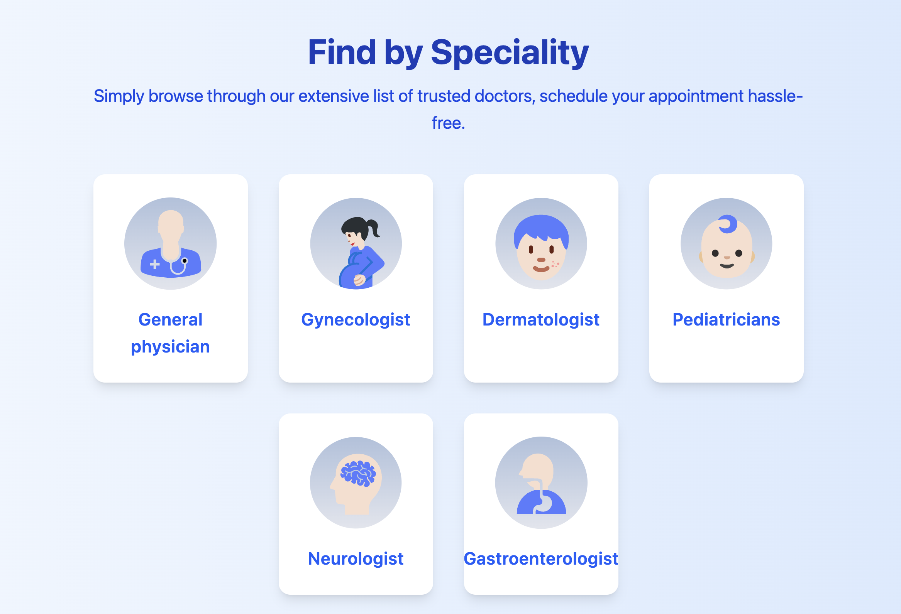
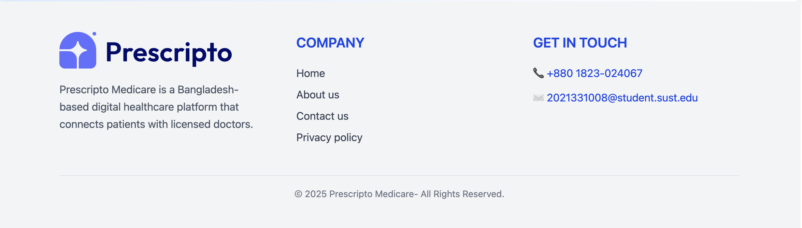
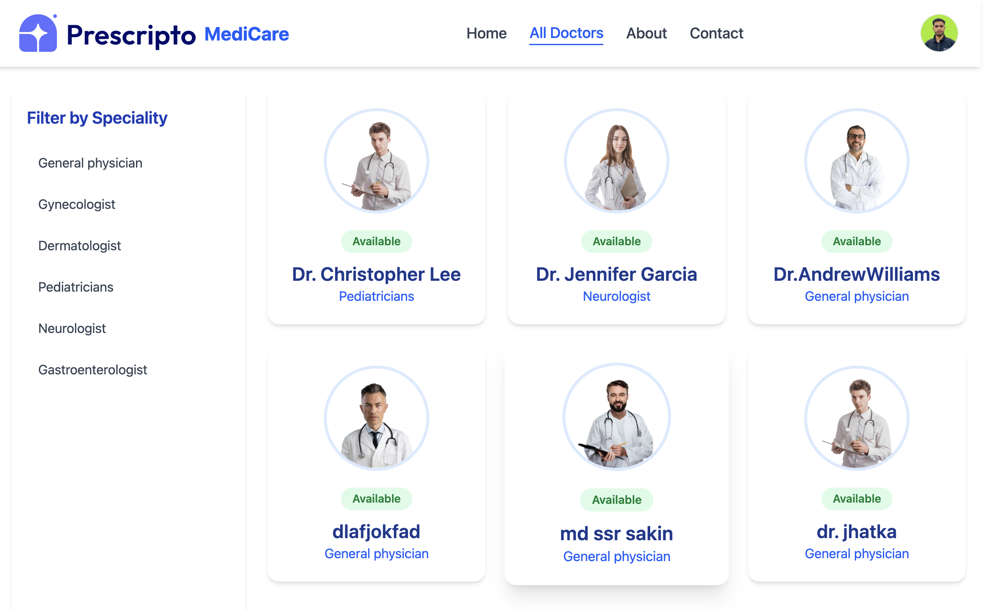
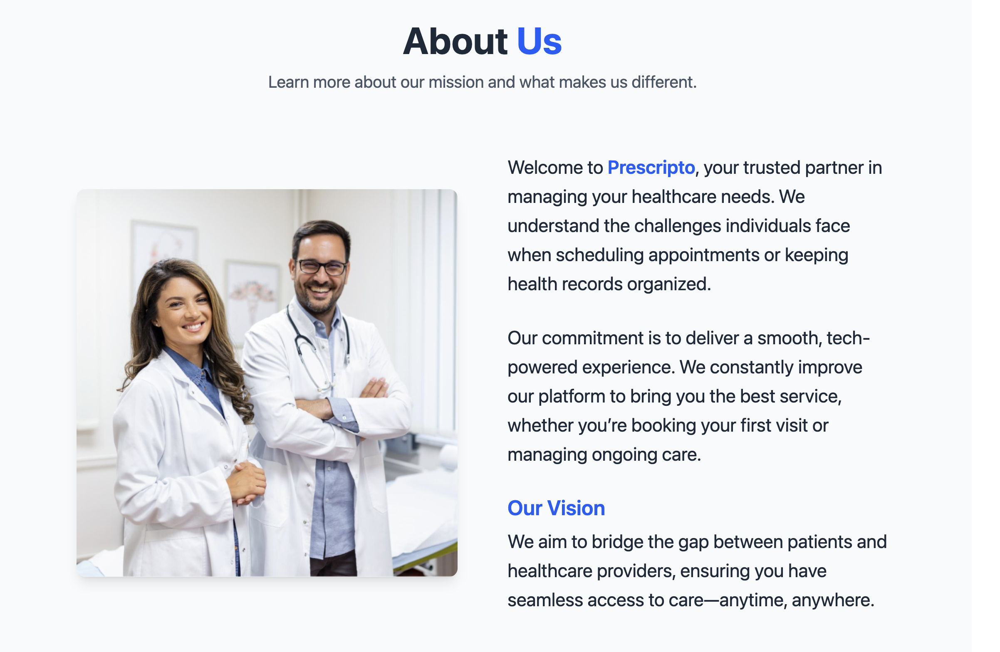
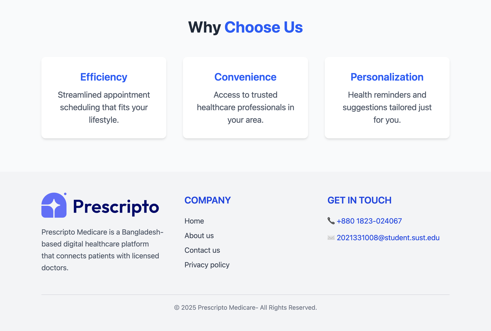
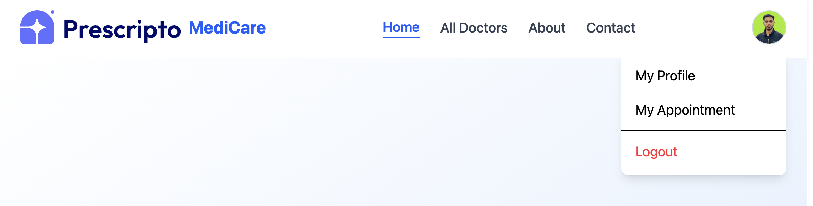

# 🏥 Medicare - Doctor's Appointment Booking System

A comprehensive full-stack healthcare platform that streamlines appointment booking between patients and healthcare providers. Built with modern web technologies, Medicare offers separate interfaces for patients, doctors, and administrators to manage healthcare appointments efficiently.


## ✨ Key Features

### 👨‍⚕️ **Patient Portal**

- **Secure Authentication** - Register and login with JWT-based security
- **Doctor Discovery** - Browse doctors by specialty with detailed profiles
- **Smart Booking** - Book appointments with real-time availability
- **Appointment Management** - View, reschedule, or cancel appointments
- **Payment Integration** - Secure payment processing with SSLCommerz
- **Profile Management** - Update personal information and medical history
- **Appointment History** - Track past and upcoming appointments

### 🩺 **Doctor Dashboard**

- **Schedule Management** - View and manage daily appointment schedules
- **Appointment Control** - Accept, reject, or reschedule patient requests
- **Patient Information** - Access patient details and medical history
- **Availability Settings** - Set working hours and availability
- **Profile Management** - Update professional information and credentials

### 🛠️ **Admin Panel**

- **Doctor Management** - Add, remove, and manage doctor profiles
- **User Administration** - Oversee patient and doctor accounts
- **Appointment Oversight** - Monitor all appointments across the platform
- **Analytics Dashboard** - View system statistics and reports
- **Content Management** - Manage specialties, services, and platform content

## 🏗️ Architecture

This project follows a **microservices architecture** with three main applications:

```
medicare/
├── frontend/          # Patient-facing React application
├── admin/            # Admin dashboard React application
├── backend/          # Node.js API server
└── Prescripto_medicare/ # Screenshots and assets
```

## 🧰 Technology Stack

### **Frontend Applications**

- **React 19** - Modern UI library with hooks
- **Vite** - Fast build tool and development server
- **Tailwind CSS 4** - Utility-first CSS framework
- **React Router DOM** - Client-side routing
- **Framer Motion** - Smooth animations and transitions
- **Axios** - HTTP client for API communication
- **React Toastify** - User-friendly notifications
- **Lucide React** - Beautiful icon library

### **Backend Services**

- **Node.js** - JavaScript runtime environment
- **Express.js** - Web application framework
- **MongoDB** - NoSQL database with Mongoose ODM
- **JWT** - JSON Web Tokens for authentication
- **Bcrypt** - Password hashing and security
- **Cloudinary** - Image upload and management
- **Multer** - File upload middleware
- **SSLCommerz** - Payment gateway integration
- **Validator** - Data validation utilities

### **Development Tools**

- **ESLint** - Code linting and formatting
- **Nodemon** - Development server auto-restart
- **CORS** - Cross-origin resource sharing
- **dotenv** - Environment variable management

## 🚀 Quick Start

### Prerequisites

- Node.js (v18 or higher)
- MongoDB (local or cloud instance)
- Cloudinary account (for image uploads)
- SSLCommerz account (for payments)

### 1. Clone the Repository

```bash
git clone https://github.com/Sakin08/Doctors-Appointment-Booking-system.git
cd Doctors-Appointment-Booking-system
```

### 2. Backend Setup

```bash
cd backend
npm install
```

Create `.env` file in the backend directory:

```env
PORT=4000
MONGODB_URI=your_mongodb_connection_string
JWT_SECRET=your_jwt_secret_key
ADMIN_EMAIL=admin@medicare.com
ADMIN_PASSWORD=your_admin_password

# Cloudinary Configuration
CLOUDINARY_NAME=your_cloudinary_name
CLOUDINARY_API_KEY=your_api_key
CLOUDINARY_SECRET_KEY=your_secret_key

# SSLCommerz Configuration
STORE_ID=your_store_id
STORE_PASSWORD=your_store_password
IS_LIVE=false
```

### 3. Frontend Setup

```bash
cd ../frontend
npm install
```

Create `.env` file in the frontend directory:

```env
VITE_BACKEND_URL=http://localhost:4000
```

### 4. Admin Panel Setup

```bash
cd ../admin
npm install
```

Create `.env` file in the admin directory:

```env
VITE_BACKEND_URL=http://localhost:4000
```

### 5. Start Development Servers

**Terminal 1 - Backend:**

```bash
cd backend
npm run server
```

**Terminal 2 - Frontend:**

```bash
cd frontend
npm run dev
```

**Terminal 3 - Admin Panel:**

```bash
cd admin
npm run dev
```

### 6. Access the Applications

- **Patient Portal**: https://medicare-two-rosy.vercel.app/
- **Admin Dashboard**: https://medicare-admin-doctor-panel.vercel.app/
- **API Server**: https://medicare-backend-lime.vercel.app/

## 📱 Application Screenshots

<div align="center">

### Patient Portal

| Home Page                          | Doctor Listings                       | Appointment Booking                   |
| ---------------------------------- | ------------------------------------- | ------------------------------------- |
|  |  |  |

### Admin Dashboard

| Dashboard                                     | Doctor Management                               | Appointments                               |
| --------------------------------------------- | ----------------------------------------------- | ------------------------------------------ |
|  |  |  |

### Doctor Portal

| Doctor Dashboard                               | Schedule View                          | Profile Management                    |
| ---------------------------------------------- | -------------------------------------- | ------------------------------------- |
|  |  |  |

</div>

## 🔧 API Endpoints

### Authentication

- `POST /api/user/register` - Patient registration
- `POST /api/user/login` - Patient login
- `POST /api/doctor/login` - Doctor login
- `POST /api/admin/login` - Admin login

### Appointments

- `GET /api/user/appointments` - Get user appointments
- `POST /api/user/book-appointment` - Book new appointment
- `POST /api/user/cancel-appointment` - Cancel appointment
- `GET /api/doctor/appointments` - Get doctor appointments
- `POST /api/doctor/complete-appointment` - Mark appointment complete

### Doctors

- `GET /api/user/doctors` - Get all doctors
- `GET /api/user/doctor/:id` - Get doctor details
- `POST /api/admin/add-doctor` - Add new doctor
- `GET /api/admin/doctors` - Get all doctors (admin)

### Payments

- `POST /api/payment/sslcommerz` - Process payment
- `POST /api/payment/success` - Payment success callback
- `POST /api/payment/fail` - Payment failure callback

## 🌐 Deployment

### Backend (Vercel)

```json
{
  "version": 2,
  "builds": [
    {
      "src": "./server.js",
      "use": "@vercel/node"
    }
  ],
  "routes": [
    {
      "src": "/(.*)",
      "dest": "/"
    }
  ]
}
```

### Frontend (Vercel)

```json
{
  "rewrites": [
    {
      "source": "/(.*)",
      "destination": "/index.html"
    }
  ]
}
```

## 🤝 Contributing

1. Fork the repository
2. Create a feature branch (`git checkout -b feature/AmazingFeature`)
3. Commit your changes (`git commit -m 'Add some AmazingFeature'`)
4. Push to the branch (`git push origin feature/AmazingFeature`)
5. Open a Pull Request

## 📝 License

This project is licensed under the MIT License - see the [LICENSE](LICENSE) file for details.

## 👨‍💻 Author

**MD. SOHANOOR RAHAMAN SAKIN**

- 📧 Email: mdsrsakin2001@gmail.com
- 🔗 GitHub: [@Sakin08](https://github.com/Sakin08)
- 💼 LinkedIn: [Connect with me](https://linkedin.com/in/sakin08)

## 🙏 Acknowledgments

- Thanks to all healthcare professionals who inspired this project
- Special thanks to the open-source community for the amazing tools
- Icons provided by [Lucide React](https://lucide.dev/)
- UI inspiration from modern healthcare platforms

---

<div align="center">

**⭐ Star this repository if you found it helpful!**

Made with ❤️ for better healthcare accessibility

</div>
